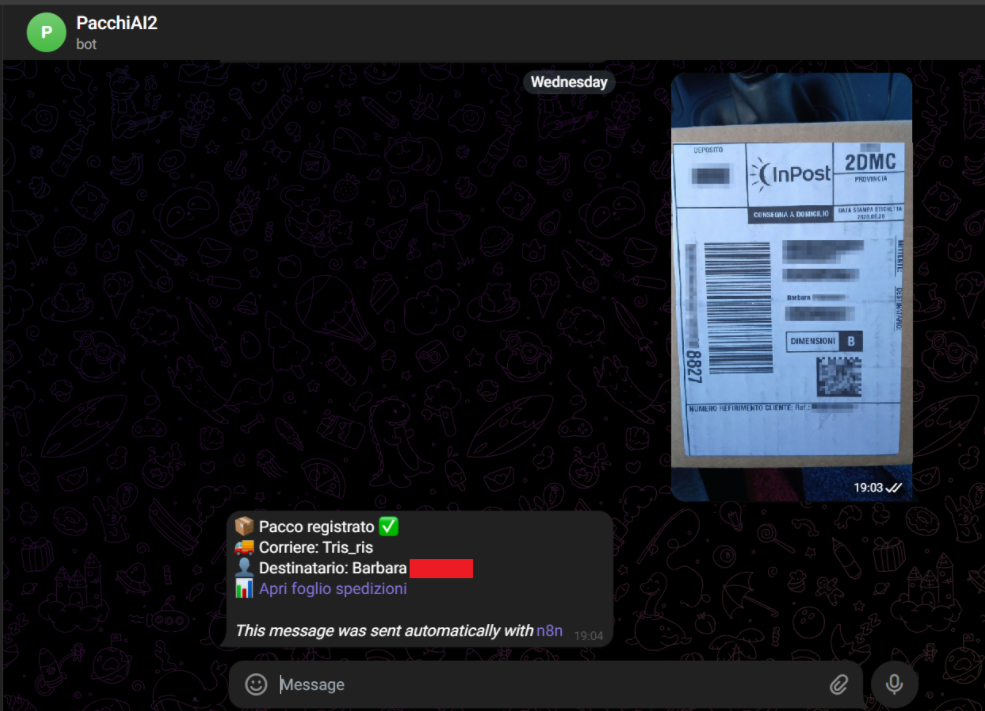
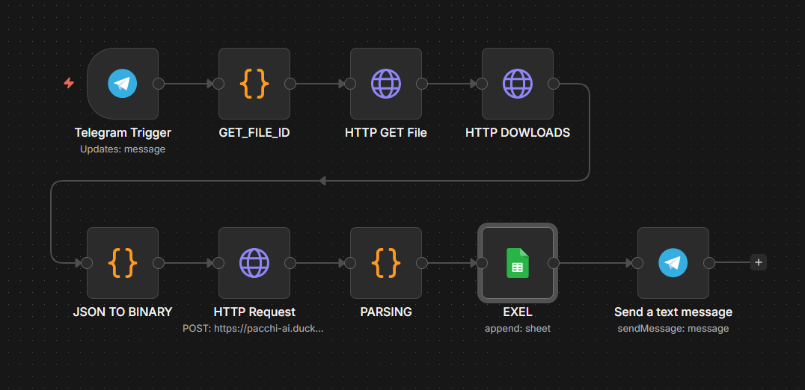
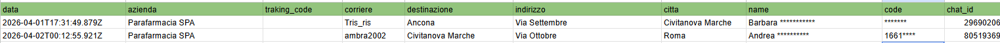

# RAG - Telegram - OCR model - Extract text to image

<p align="center">
  
  
</p>

Sistema semplice e automatico per gestire immagini di come uno scontrino o un’etichetta. Basta inviare una foto (come uno scontrino o un’etichetta) su Telegram e il sistema legge il contenuto e lo salva automaticamente in un foglio Google, senza dover fare nulla manualmente. Poi lo restituisce nella chat.
Sistema automatizzato per la gestione di documenti tramite chat Telegram: un bot riceve immagini (es. etichette o scontrini) tramite **Telegram Bot API** e le inoltra, tramite **webhook**, a un workflow orchestrato in **n8n**. Il servizio è deployato su **VPS Host.it** con **Docker**, esposto pubblicamente tramite **Nginx** (reverse proxy) e **DuckDNS** per la gestione del dominio.Le immagini vengono elaborate da un microservizio **FastAPI OCR (porta 8000)** basato su **TesseractOCR**, sviluppato in **Python**, che estrae il testo in modo completamente locale, riducendo i costi operativi. I dati vengono poi processati tramite logica custom in **Javascript** (n8n) e script **bash**, e salvati in modo strutturato su **Google Sheets**. L’integrazione con i servizi Google è gestita tramite **Google Cloud Console**, utilizzata per configurare le credenziali OAuth necessarie. L’intero sistema è progettato per essere scalabile, economico e indipendente da API a pagamento, mantenendo un flusso real-time completamente automatizzato.

## ⚙️ TECNOLOGIE
- VPS (Host.it)
- Docker / Docker Compose
- n8n (workflow automation)
- Nginx (reverse proxy)
- DuckDNS (DNS dinamico)
- Telegram Bot API
- FastAPI OCR (porta 8000)
- TesseractOCR
- Google Sheets API
- Google Cloud Console
- Python / Javascript / Bash

---

## 🔐 ACCESSO SERVER
```bash
ssh root@***IP_SERVER***
cd ~/ocr-server
```

---

## 🐳 DOCKER
```bash
docker ps
docker ps -a
docker images

docker logs ocr-container -f
docker logs n8n -f

docker stop ocr-container 2>/dev/null || true
docker rm ocr-container 2>/dev/null || true

docker rm -f n8n
docker rm -f $(docker ps -aq)

docker build -t ocr .
docker build --no-cache -t ocr .

docker run -d -p 8000:8000 ocr

docker run -d \
  --name n8n \
  --restart unless-stopped \
  -p 5678:5678 \
  -v n8n_data:/home/node/.n8n \
  -e N8N_SECURE_COOKIE=false \
  -e WEBHOOK_URL=https://***DOMINIO*** \
  -e N8N_HOST=***DOMINIO*** \
  -e N8N_PROTOCOL=https \
  n8nio/n8n

docker restart n8n
docker restart ocr-container
```

---

## 🖥️ SETUP SERVER BASE
```bash
apt update && apt upgrade -y
apt install docker.io nginx curl wget ufw -y

systemctl start docker
systemctl enable docker
systemctl restart nginx
```

---

## 📁 OCR SERVER (FastAPI)
```bash
mkdir ocr-server
cd ocr-server

nano main.py
nano Dockerfile

docker build -t ocr .
docker run -d --name ocr-container --restart unless-stopped -p 8000:8000 ocr

curl http://localhost:8000/docs
```

---

## 🌍 DUCKDNS
```bash
mkdir ~/duckdns
cd ~/duckdns

nano duck.sh
chmod +x duck.sh

./duck.sh
crontab -e
```

---

## 🌐 NGINX (Reverse Proxy)
```bash
nano /etc/nginx/sites-available/n8n
ln -sf /etc/nginx/sites-available/n8n /etc/nginx/sites-enabled/
rm -f /etc/nginx/sites-enabled/default

nginx -t
systemctl restart nginx
```

### Config base
```nginx
server {
    listen 80;
    server_name ***DOMINIO***;

    location / {
        proxy_pass http://127.0.0.1:5678;

        proxy_http_version 1.1;
        proxy_set_header Upgrade $http_upgrade;
        proxy_set_header Connection "upgrade";

        proxy_set_header Host $host;
        proxy_set_header X-Real-IP $remote_addr;
        proxy_set_header X-Forwarded-For $proxy_add_x_forwarded_for;
    }
}
```

---

## 🔒 HTTPS + CERTBOT
```bash
apt install certbot python3-certbot-nginx -y

certbot --nginx -d ***DOMINIO*** \
  --non-interactive \
  --agree-tos \
  --email ***EMAIL*** \
  --redirect

ufw allow 443/tcp
ufw allow 80/tcp
ufw reload
ufw status
```

---

## 🤖 TELEGRAM WEBHOOK
```bash
BOT_TOKEN="***TOKEN***"

curl "https://api.telegram.org/bot${BOT_TOKEN}/deleteWebhook"

curl -X POST "https://api.telegram.org/bot${BOT_TOKEN}/setWebhook" \
-H "Content-Type: application/json" \
-d "{\"url\": \"https://***DOMINIO***/webhook/telegram\"}"

curl "https://api.telegram.org/bot${BOT_TOKEN}/getWebhookInfo"
```

---

## 🧪 TEST SISTEMA
```bash
curl -I https://***DOMINIO***
curl https://***DOMINIO***/healthz
curl http://localhost:5678/healthz
curl http://localhost:8000/docs

ss -tlnp | grep -E ':(80|443|5678|8000)'
dig ***DOMINIO***

systemctl status nginx
docker logs n8n -f
```

---

## 🧪 TEST OCR (FILE)
```bash
wget -O /tmp/test.jpg "https://api.telegram.org/file/bot***/photos/file_3.jpg"

curl -X POST https://***DOMINIO***/ocr \
-F "file=@/tmp/test.jpg"
```

### Response esempio
```json
{
  "text": "DEPOSITO\n...\nNUMERO RIFERIMENTO CLIENTE: 001661030",
  "status": "success",
  "lines_found": 58
}
```

---

## 🧪 TEST OCR (URL)
```bash
curl -X POST https://***DOMINIO***/ocr-from-url \
-H "Content-Type: application/json" \
-d '{"image_url":"https://api.telegram.org/file/bot***/photos/file_2.jpg"}'
```

---

## ⚠️ NOTE
- Sostituire `***DOMINIO***`, `***IP***`, `***TOKEN***`
- Configurare Google Cloud Console per OAuth2 (Google Sheets)
- Backup volume `n8n_data` consigliato
- Parsing OCR migliorabile (regex / AI locale)

---

## 📦 STRUTTURA
```bash
/ocr-server
  ├── main.py
  ├── Dockerfile
  └── requirements.txt

/docker
/docker-compose.yml (opzionale)
/n8n_data (volume)
```

---

## ✅ STATO
✔ Sistema funzionante  
✔ OCR locale attivo  
✔ Webhook Telegram attivo  
✔ HTTPS configurato  
⚠ Parsing migliorabile  
⚠ Sicurezza base migliorabile  


## 📊 SCHEMA FLOW


```
Telegram Trigger
      ↓
GET_FILE_ID (Code)
      ↓
HTTP GET File (Telegram API)
      ↓
HTTP DOWNLOAD (File binario)
      ↓
JSON TO BINARY (formatta file)
      ↓
HTTP Request (OCR FastAPI)
      ↓
PARSING (estrazione dati)
      ↓
Google Sheets (salvataggio)
      ↓
Telegram Send Message (feedback utente)
```

---

## 🧠 DESCRIZIONE GENERALE

Il workflow riceve un'immagine da Telegram, la scarica, la invia a un servizio OCR locale, estrae i dati principali (nome, indirizzo, tracking, ecc.) e li salva in Google Sheets. Infine, invia una conferma all’utente.

---

## 🔹 NODI DETTAGLIATI

### 1. 📥 Telegram Trigger
- Riceve messaggi dal bot Telegram
- Filtra solo eventi di tipo `message`
- Output: JSON con metadata (chat_id, foto, utente)

---

### 2. 🧩 GET_FILE_ID (Code)
- Estrae:
  - `file_id` (immagine Telegram)
  - `chat_id`
  - `caption`
- Seleziona la foto con qualità più alta
- Prepara dati per chiamata API Telegram

---

### 3. 🌐 HTTP GET File
- Endpoint:
  ```
  https://api.telegram.org/bot<TOKEN>/getFile
  ```
- Input: `file_id`
- Output: `file_path`

---

### 4. 📥 HTTP DOWNLOAD
- Scarica fisicamente l'immagine:
  ```
  https://api.telegram.org/file/bot<TOKEN>/<file_path>
  ```
- Output: file binario (`data`)

---

### 5. 🔄 JSON TO BINARY
- Imposta:
  - `mimeType = image/jpeg`
  - `fileName = file.jpg`
- Necessario per invio multipart al server OCR

---

### 6. 🧠 HTTP Request (OCR)
- Endpoint:
  ```
  POST /ocr
  ```
- Tipo: `multipart/form-data`
- Campo:
  ```
  file → binary data
  ```
- Output:
  ```json
  {
    "text": "...",
    "status": "success",
    "lines_found": 58
  }
  ```

---

### 7. 🧪 PARSING (Code)
Elabora il testo OCR ed estrae:

- `azienda`
- `tracking_code`
- `corriere`
- `name` (destinatario)
- `indirizzo`
- `citta`
- `code` (riferimento cliente)
- `chat_id`
- `data` (timestamp)

#### Logica principale:
- Regex su numeri lunghi → tracking
- Pattern indirizzi → via/piazza ecc.
- CAP + città → riconoscimento località
- Filtri anti-rumore OCR
- Costruzione blocchi mittente/destinatario

---

### 8. 📊 Google Sheets (EXEL)



- Operazione: `append`
- Scrive colonne:
  - data
  - azienda
  - tracking_code
  - corriere
  - destinazione
  - indirizzo
  - citta
  - name
  - code
  - chat_id

---

### 9. 📤 Telegram Send Message
Invia conferma all’utente:

```
📦 Pacco registrato ✅
🚚 Corriere: <corriere>
👤 Destinatario: <name>
📊 Link Google Sheets
```

- Formato: HTML
- Usa `chat_id` dinamico

---


---

## ⚠️ NOTE IMPORTANTI

- Sostituire:
  - `<TOKEN>` Telegram
  - URL dominio OCR
- Assicurarsi:
  - `Send Binary Data = true`
  - Campo binary = `data`
- OCR migliorabile con:
  - regex avanzate
  - modelli ML tipo PaddleOCR o Chat Gpt e Gemini , ma gli ultimi due non opean source. 

---

## ✅ RISULTATO

✔ Automazione completa  
✔ OCR locale (no costi API)  
✔ Salvataggio automatico  
✔ Feedback real-time su Telegram  

---

